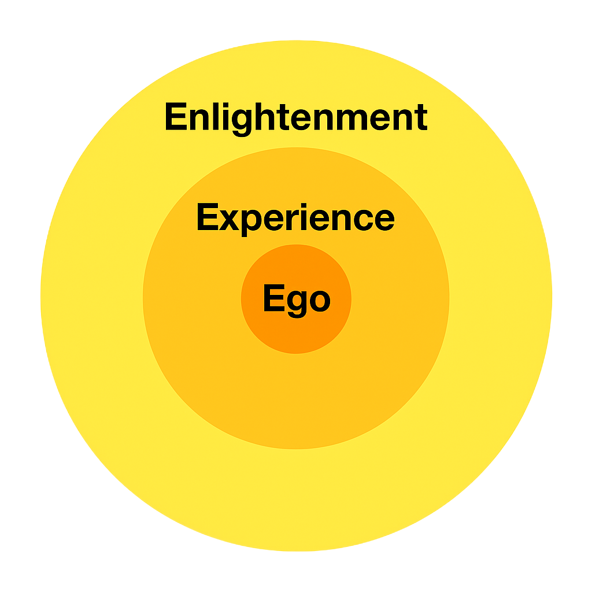

AI Meditation

This essay was generated by artificial intelligence to provide a structured guide to meditation. The content synthesizes ideas from various philosophical traditions, contemplative practices, psychology, and modern cognitive science. While the essay itself is produced by AI, the concepts presented are drawn from widely studied human knowledge.

This essay explains how the layers Ego, Experience, and Enlightenment function individually and together, providing a practical approach to meditation and daily conscious living.

Awareness is visualized as three concentric circles that overlap:

Ego – the thinking mind

Experience – the sensing body

Enlightenment – deliberate, conscious action

These layers operate in continuous interaction. Mind, Body, and Action influence one another dynamically, forming a single integrated field of consciousness. Meditation practice leverages this overlapping structure, using the breath as a central tool to harmonize thought, sensation, and deliberate awareness.

---

Ego – The Inner Circle

Primary Function:

Meaning-making, narrative identity, evaluation

Philosophical Parallel:

The constructed self, rational consciousness

The Ego is the interpretive layer of awareness. It judges, predicts, plans, and creates the narrative sense of “I”. Ego links memory, expectation, and interpretation into a coherent personal identity, producing the internal commentary that shapes perception of reality.

Role in Meditation:

Ego is observed, not suppressed. Thoughts continue, but they do not dominate attention or control the breath. Awareness of Ego reduces reactivity and promotes clarity.

---

Experience – The Middle Circle

Primary Function:

Sensing, feeling, receiving, embodied awareness

Philosophical Parallel:

The body, and direct perception

Experience is the immediate field of sensation. It includes physical sensation, emotional tone, energy, proprioception, and intuitive bodily cues. Thoughts interpret these sensations, creating overlap with Ego.

Role in Meditation:

The breath is felt rather than analyzed. Bodily sensations emerge naturally, grounding attention and providing emotional clarity.

---

Enlightenment – The Outer Circle

Primary Function:

Deliberate action, executive guidance, clarity of awareness

Philosophical Parallel:

Wisdom, executive function, mindful direction

Enlightenment integrates mind and body into intentional action. It chooses, directs, and harmonizes conscious processes, including the breath, with full awareness.

Role in Meditation:

Enlightenment directs the breath consciously, harmonizing Ego’s thoughts and Experience’s sensations into unified, purposeful action.

---

Interactions Between the Layers

The three layers function as an interdependent system:

Ego interprets, judges, and narrates

Experience senses, feels, and embodies

Enlightenment directs intention and action

Each breath becomes a moment where:

Mind is thinking

Body is sensing

Action is creating

The breath serves as the central integrating force:

Ego notices it

Experience feels it

Enlightenment guides it

This integration produces coherent, unified awareness.

---

Practical Meditation Steps

Sit Comfortably:

Relax the body and observe natural breath.

Engage Ego:

Observe thoughts and impulses without granting control.

Engage Experience:

Attend to the chest, flow of air, and subtle movements. Allow sensing without interference.

Activate Enlightenment:

Guide the breath deliberately. Mind thinks, body senses, and Enlightenment directs rhythm and depth.

Rest in Alignment:

Maintain awareness of all three layers simultaneously.

Even brief practice reinforces the integration of thought, perception, and deliberate action.

---

Cross-Traditional Relationships

Buddhism

A contemplative tradition focused on understanding suffering, mindfulness, and the nature of the self through direct observation of mind and body.

Ego – Manas: Mind that assigns ownership; creates the sense of “selfing”

Experience – Vedana: Felt quality of sensations; bodily awareness

Enlightenment – Panna: Wisdom guiding ethical, deliberate action

---

Hindu Philosophy

A spiritual system exploring the nature of the self, the layers of human experience, and the unity of individual consciousness with ultimate reality.

Ego – Ahamkara: “I-maker,” sense of personal identity

Experience – Annamaya + Pranamaya Kosha: Physical body and breath/energy body

Enlightenment – Vijnanamaya Kosha: Insight and conscious guidance of action

---

Yoga

A practical discipline unifying body, breath, and mind through posture, breathwork, attention, and ethical practice, interpreted through the kosha framework.

Ego – Manomaya Kosha: Mental sheath; thoughts, emotions, mental imagery

Experience – Annamaya + Pranamaya Koshas: Physical sensation and subtle energy perception

Enlightenment – Vijnanamaya Kosha: Intellectual discernment and intentional guidance

---

Cognitive Psychology

A scientific field studying how the mind interprets, remembers, senses, and controls behavior through measurable cognitive processes.

Ego – Thinking: Working memory, interpretation, planning

Experience – Sensing: Body-based perception, interoception

Enlightenment – Executive Function: Metacognition, planning, conscious control

---

Phenomenology

A philosophical approach examining consciousness as it is lived, emphasizing the structure of perception and the immediacy of experience.

Ego – Noesis: The act of thinking and structuring experience

Experience – Noema: The content of experience; the lived, felt sensation

Enlightenment – Intentional Action: Purposeful, consciously guided behavior

---

Taoism / Qigong

A tradition emphasizing harmony with natural flow, cultivating internal energy, and acting effortlessly through alignment with the Tao.

Ego – Shen (Spirit / Consciousness) Observing Mind: The witnessing mind that sees thoughts and sensations

Experience – Qi (Life Energy), Jing (Vital Essence) Sensing Body & Qi: Awareness of the body and internal energy flow

Enlightenment – Yi (Intent / Focused Awareness) Directing Intention & Flow: Guiding movement, breath, and energy with awareness

---

IFS Therapy

A therapeutic model viewing the psyche as composed of inner “parts”; healing occurs when these parts are led by the calm, centered Self.

Ego – Parts: Internal sub-personalities that form identity

Experience – Felt Sense: Bodily and emotional perception

Enlightenment – Self: The calm, centered, wise core that directs action and awareness

---

Summary

Ego = Mind, thought, self-awareness, narrative identity

Experience = Body, sensation, feeling, lived experience

Enlightenment = Conscious guidance, deliberate action, wisdom

Across all traditions, thought (Ego), sensation (Experience), and intention/action (Enlightenment) form one continuous, integrated field of consciousness.

---

AI-Generated Notice

This essay was generated by artificial intelligence. While the synthesis, organization, and explanatory language are AI-created, the concepts and terminology are drawn from established sources in philosophy, psychology, meditation, and cognitive science.

Key influences include:

Buddhism: Manas, Vedana, Kayanuppassana, Samadhi, Panna

Hindu Philosophy and Yoga: Ahamkara, Annamaya Kosha, Pranamaya Kosha, Manomaya Kosha, Vijnanamaya Kosha

Western Philosophy: Rational consciousness, reflective self-awareness

Cognitive Psychology and Neuroscience: Working memory, executive function, metacognition, interoception

Phenomenology: Merleau-Ponty, Le Corps Propre
Taoism and Qigong: Qi, Wu Wei, and related practices

This AI-generated framework integrates these historical, philosophical, and scientific insights into a coherent meditation guide.

---
